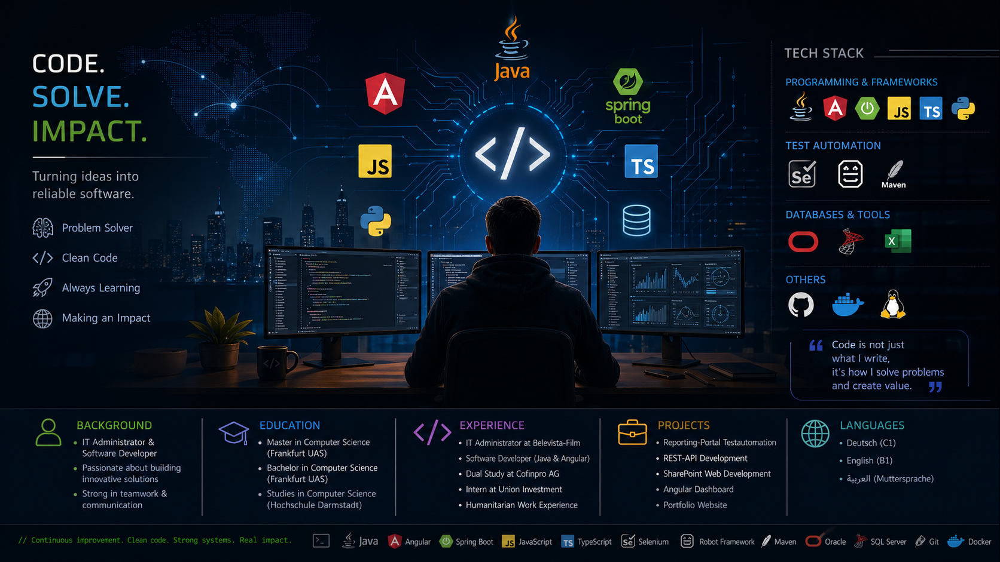

<!-- Portfolio Banner -->

  

<h1 align="center">👋 Hi, ich bin Kaddour Alnaasan</h1>

<b>IT-Administrator & Master Informatik-Student</b> Frankfurt am Main, Germany

---

## 🧑‍💻 Über mich

<blockquote>
<b>Leidenschaftlicher IT-Administrator und Softwareentwickler</b> mit Schwerpunkt auf <b>Java</b>, <b>Angular</b>, <b>Spring Boot</b>, <b>JavaScript</b> und <b>TypeScript</b>. 
Mit Erfahrung in <b>Webentwicklung</b>, <b>Testautomatisierung</b> und <b>innovativen Softwarelösungen</b> biete ich vielseitige Kompetenzen für komplexe technische Herausforderungen.
</blockquote>

---

## 🚀 Skills & Technologien

<b>Programmiersprachen & Frameworks:</b>
<ul>
  <li>☕ <b>Java</b> (75%)</li>
  <li>🅰️ <b>Angular</b> (80%)</li>
  <li>🌱 <b>Spring Boot</b> (70%)</li>
  <li>🐍 <b>Python</b> (40%)</li>
  <li>✨ <b>JavaScript</b> (85%)</li>
  <li>🟦 <b>TypeScript</b> (80%)</li>
</ul>

<b>Testautomatisierung:</b>
<ul>
  <li>🧪 <b>Selenium Grid Server</b> (65%)</li>
  <li>🤖 <b>Robot Framework</b> (80%)</li>
  <li>📦 <b>Maven</b> (85%)</li>
</ul>

<b>Datenbanken & EDV:</b>
<ul>
  <li>🗄️ <b>Oracle Database</b> (80%)</li>
  <li>🗃️ <b>Microsoft SQL-Server</b> (75%)</li>
  <li>📊 <b>MS Office</b> (90%)</li>
</ul>

<b>Sprachkenntnisse:</b>
<ul>
  <li>🇩🇪 <b>Deutsch</b> (C1)</li>
  <li>🇬🇧 <b>Englisch</b> (B1)</li>
  <li>🇸🇾 <b>Arabisch</b> (Muttersprache)</li>
</ul>

---

---

## 💼 Berufserfahrung

**IT-Administrator**  
Belevista-Film, Frankfurt am Main (03/2023 – heute)  
Software-Entwicklung (Java & Angular), Planung neuer Anforderungen, tägliche IT-Aufgaben

**Duales Studium (Informatik)**  
Cofinpro AG, Frankfurt am Main (10/2019 – 03/2021)  
Software-Entwicklung (Java), REST-Schnittstellen, JPA-Entities, Meetings

**Praktikant**  
Union Investment, Frankfurt am Main (07/2017 – 09/2019)  
Webentwicklung (SharePoint, Java), Testautomation für Reporting-Portale

**Humanitäre Arbeit**  
Save the Children, Antakya/Türkei (05/2015)  
Datenpflege, Berichterstattung

**Mitarbeiter**  
Danish Refugee Council, Antakya/Türkei (02/2015 – 08/2015)  
Datenpflege, Berichterstattung

---

## 🎓 Ausbildung

**Masterstudium Informatik**  
Frankfurt University of Applied Sciences (09/2023 – heute)

**Bachelorstudium Informatik**  
Frankfurt University of Applied Sciences (04/2021 – 08/2023)

**Studium der Informatik**  
Hochschule Darmstadt (10/2019 – 03/2021)

**DSH-Kurs**  
Frankfurt University of Applied Sciences (04/2019 – 08/2019) – DSH2-Niveau

**Deutsch Sprachkurs**  
Goethe-Universität Frankfurt (04/2017 – 07/2018) – DSH1-Niveau

**Studium der Informatik**  
Universität von Aleppo (09/2011 – 09/2014, kriegsbedingt abgebrochen)

**Weiterbildungen & Zertifikate:**
- Seminar in freiwilliger Mitarbeit in Krisengebieten (IOM, Aleppo/Syrien, 05/2014)
- Computerseminare (New Horizons-Institut, Aleppo/Syrien, 09/2014 – 12/2014)

---

## 🛠️ Projekte

**Reporting-Portal Testautomation**  
Java, Selenium, Robot Framework  
Entwicklung eines Testautomations-Frameworks für Reporting-Portale bei Union Investment.

**REST-API Entwicklung**  
Java, Spring Boot, JPA  
Entwicklung einer REST-API mit Sicherheitsfeatures und Swagger-Dokumentation (Cofinpro AG).

**SharePoint-basierte Webentwicklung**  
JavaScript, SharePoint, HTML/CSS  
Entwicklung und Anpassung von SharePoint-Lösungen (Union Investment).

**Angular-basiertes Dashboard**  
Angular, TypeScript, Tailwind CSS  
Entwicklung eines modernen Dashboards mit Echtzeit-Datenvisualisierung (Belevista-Film).

**Portfolio Website**  
Angular, Tailwind CSS, Responsive Design  
Gestaltung und Entwicklung meiner persönlichen Portfolio-Website.

---

## 📫 Kontakt & Social Media

- 📧 [Kaddour@alnaasan.de](mailto:Kaddour@alnaasan.de)
- 📞 [+49 123 456 7890](tel:+491234567890)
- 🌍 Frankfurt am Main, Deutschland
- <a href="https://www.linkedin.com/in/kalnaasan/">LinkedIn</a> | <a href="https://github.com/kalnaasan">GitHub</a> | <a href="https://xing.com/">Xing</a>

  

---

<!--Github stats Table--> 
<h2 align="center">📊 Gɪᴛʜᴜʙ Sᴛᴀᴛs 📊</h2>

<table width="100%">
  <tr>
    <td width="50%">
      <h3 align="center"><strong>Gɪᴛʜᴜʙ Sᴛᴀᴛs</strong></h3>
      

        
      

    </td>
    <td width="50%">
      <h3 align="center"><strong>Sᴛʀᴇᴀᴋ Sᴛᴀᴛs</strong></h3>
      

        
      

    </td>
  </tr>
  <tr>
    <td width="50%">
      <h3 align="center"><strong>Lᴀᴛᴇsᴛ Pʀᴏᴊᴇᴄᴛ</strong></h3>
      

        
      

    </td>
    <td width="50%">
      <h3 align="center"><strong>Tᴏᴘ Cᴏɴᴛʀɪʙᴜᴛɪᴏɴs</strong></h3>
      

        
      

    </td>
  </tr>
</table>
 

<!--Contribution Graph-->
<h2 align="center">📈 Cᴏɴᴛʀɪʙᴜᴛɪᴏɴ Gʀᴀᴘʜ 📈</h2>

    

---

<!--Dynamic Quote card updates everyday at 12 PM--> 
<h2 align="center">🌟 Tʜᴏᴜɢʜᴛ ᴏғ ᴛʜᴇ Dᴀʏ 🌟</h2>

<!--STARTS_HERE_QUOTE_CARD-->

    

<!--ENDS_HERE_QUOTE_CARD-->

<!--Contact Section--> 

<h2 align="center">🤝 Cᴏɴɴᴇᴄᴛ Wɪᴛʜ Mᴇ 🤝 </h2>

  

 

<!--Buy me a coffee-->

  

<!--Footer--> 

  

